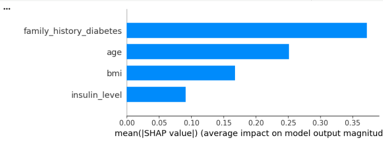

  
  
  
  

# 📖 프로젝트 주제 : 대사 지표 간 연관성 분석: 회귀분석 및 분산분석, 로지스틱 회귀분석을 활용한 통계적 접근
- 대사 지표(혈당, 인슐린, BMI 등) 사이의 상관관계를 통계적으로 규명하고, 머신러닝 모델을 통해 당뇨병 고위험군을 예측하는 엔드투엔드 분석 프로젝트입니다.

## 1. Project Overview 
- **주제** : 생활 습관 또는 신체 상태를 활용한 당뇨병 유무 분류
- **데이터셋** : [Diabetes Health Indicators Dataset](https://www.kaggle.com/datasets/mohankrishnathalla/diabetes-health-indicators-dataset/data)
- **핵심 목표** : 설문지를 활용해서 **당뇨병 고위험군을 선별할 수 있는 예측 모델** 구축

## 2. Data Dictionary (주요 핵심 변수)
- 분석에 사용된 주요 생체 지표 및 임상 데이터 (총 31개 변수 사용)

| 변수명 | 설명 | 비고 |
| :--- | :--- | :--- |
| **HbA1c** | 당화혈색소 | 지난 3개월간의 평균 혈당 상태 |
| **Glucose** | 공복 혈당 수치 | 당뇨 진단의 핵심 지표 |
| **Insulin** | 인슐린 수치 | 인슐린 저항성 확인 지표 |
| **BMI** | 체질량 지수 | 비만도 측정 |
| **Triglycerides** | 중성지방 | 혈중 지방 농도 |
| **HDL** | 고밀도 콜레스테롤 | '좋은' 콜레스테롤 수치 |
| **Outcome** | 당뇨 여부 (**Target**) | 0: 정상, 1: 당뇨 |

## 3. Problem Definition
- **데이터 특성** : 31개의 변수와 약 10만 건의 데이터를 활용하여 대사 지표 간의 복합적 관계 분석
- **분석 방향**
    + **통계 분석** : 다중회귀(인슐린 영향 요인), 분산분석(단계별 HbA1c 차이), 로지스틱 회귀(발병 확률)
    + **머신러닝** : Logistic Regression, Decision Tree, XGBoost, LightGBM 비교 분석

## 4. Data Preprocessing
- **클래스 불균형 해소** : Stratified Sampling을 적용하여 학습 및 검증 데이터의 타겟 비율 유지
- **범주형 변수 처리** + 순서형(Ordinal): 학력, 소득 등 계층 데이터 처리
    + 명목형(One-Hot): 성별, 거주지 등 범주 데이터 처리
- **데이터 스케일링** : StandardScaler를 적용하여 수치형 변수의 단위 표준화

## 5. 통계분석 핵심 인사이트
- **인슐린 수치 영향** : BMI가 인슐린 수치 상승에 가장 강력한 정(+)의 영향을 미치며, 통계적으로 매우 유의함($p < 0.001$).
- **HbA1c 검증** : 식후 혈당($r=0.93$)이 당화혈색소 결정의 핵심 요인임을 확인. ANOVA 분석 결과 당뇨 진행 단계에 따라 HbA1c 수치가 유의미하게 차이남을 검증.
- **혈당 보호 요인** : HDL 콜레스테롤은 공복 혈당을 낮추는 보호 요인으로 작용하는 반면, 중성지방은 혈당을 높이는 위험 요인으로 작용.

## 6. 모델링 평가지표
- 분석 결과, 변수 중요도가 낮은 항목을 제거한 **LightGBM(Reduced)** 모델이 최적의 성능을 보임.

| Model | CV ROC-AUC | Val ROC-AUC | 비고 |
| :--- | :--- | :--- | :--- |
| Logistic Regression | 0.6937 | 0.6940 | Baseline |
| Decision Tree | 0.6908 | 0.6917 | - |
| XGBoost | 0.7238 | 0.7239 | - |
| **LightGBM (Final)** | **0.7251** | **0.7255** | **최종 모델 선정** |

> **Note** : 변수 선택(Feature Selection)을 통해 Kaggle Public Score가 0.6936에서 **0.6961**로 향상됨.

## 7. Feature Importance (옵션)
- SHAP 활용
- 예측 모델에서 영향력이 가장 컸던 지표 순위
1. AGE
2. BMI

## 8. Conclusion
- 결론1 : BMI는 당뇨병 발생 위험의 가장 강력한 예측인자
- 결론2 : 나이가 증가함에 따라 당뇨병 발생 위험이 증가
- 결론3 : 인슐린 저항성은 비만과 밀접한 관련

# 보고서
- 프로젝트 상세 보고서는 PDF 슬라이드 자료를 참고하여 주세요
- 00 보고서 : [당뇨병 예측 모델링: 통계분석 및 머신러닝 접근](report/프로젝트보고서.pdf)
- 분석코드 : [분석코드](분석코드.ipynb)

# 🔗 배지 및 이모지 공식 소스 링크
| 용도 | 사이트 이름 | 링크 |
| :--- | :--- | :--- |
| **배지 생성** | Shields.io | [https://shields.io/](https://shields.io/) |
| **로고/색상 검색** | Simple Icons | [https://simpleicons.org/](https://simpleicons.org/) |
| **이모지 검색** | Emoji Cheat Sheet | [https://github.com/ikatyang/emoji-cheat-sheet](https://github.com/ikatyang/emoji-cheat-sheet) |